#  Module 1: File Processing 

In this module you will use Azure Storage, Azure Function, and Azure Cosmos DB to process data from a JSON file. The Azure Function will be triggered when a new JSON file is created in Azure storage. The Azure Function will read the data and populate records into an Azure Cosmos DB table.

## Architecture Overview
<kbd>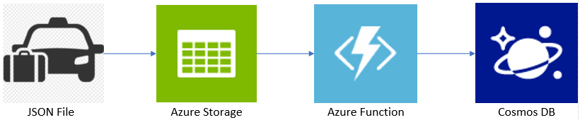</kbd>

A JSON file is uploaded to Azure storage. A [blob trigger][blob-trigger] configured on an Azure Function is triggered when a blob is added in the Azure storage container. The Azure Function retrieves the file, processes it, and populates the Cosmos DB with the data from the JSON file. 

## Implementation Instructions

### 1. Create Azure Resources

<details>
<summary><strong>Step-by-step instructions (expand for details)</strong></summary><p>

1. Log into the Azure Management Portal with an account that has permissions to deploy new Azure resources.

2. To deploy a customized template through the portal, click **Create a resource**, and search for **Template Deployment** until you can select it from the options.

3. Click **Template Deployment**

4. Click **Create**

5. You see several options for creating a template. Click **Build your own template in the editor**.

6. You now have a blank template that is available for customizing. Delete the JSON in the blank template, then paste in the JSON from the following file [azuredeploy.json](azuredeploy.json).

7. **Click Save**.

8. Enter a new name for the Resource group.  **For example**: File-Processing

9. Check the **I agree to the terms and conditions stated above** checkbox.

10. Click **Purchase**.

11. After the Azure resources are deployed, continue with the steps below.

</p></details>

### 2. Storage Account Configuration

<details>
<summary><strong>Step-by-step instructions (expand for details)</strong></summary><p>

1. Go to the **Storage Account** created by the ARM template
   **For example:**
   <kbd>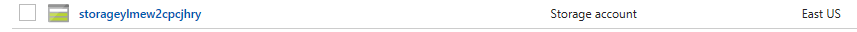</kbd>

2. Create a container named **filecontents** under the Blob service. 
   **For example:**
   <kbd>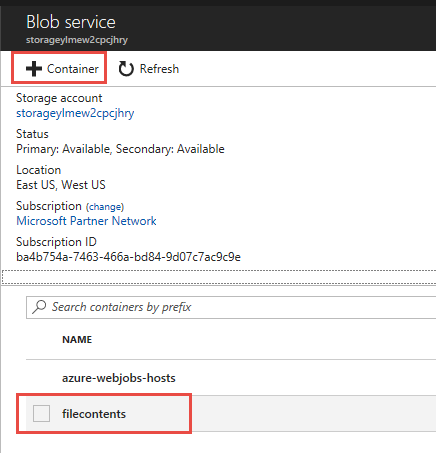</kbd>

### 3 Azure Function Configuration

<details>
<summary><strong>Step-by-step instructions (expand for details)</strong></summary><p>

1. Go to the **Azure Function App Service** created by the ARM template.
   **For example:**
   <kbd>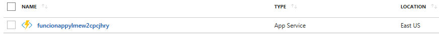</kbd>

2. Create a Blob trigger function named FileProcessing.  See the Create a Blob storage triggered function in [this article][this-article] to see how to do it.  Use the settings in the screenshot below to create the New Function.
   **For example:**
   <kbd></kbd>

3. Refer to [the article][the-article] to open a debug console and navigate to the ```D:\home\site\wwwroot\FileProcessing``` folder.
   **For example:**
   <kbd></kbd>
4. Replace the index.js file shown in the screenshot with the [index.js](assets/index.js) file in this sample’s source code.  You can easily do this by dragging and dropping the index.js file from your local file system into the web page. 
   **For example:**
   <kbd>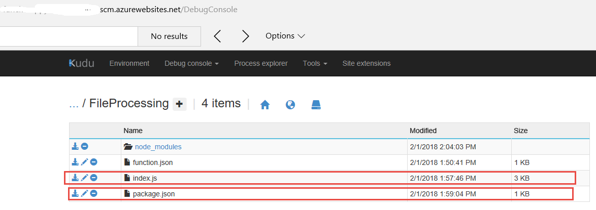</kbd>

5. Add the package.json file in this sample’s source code.  It is found in this file path [package.json](assets/package.json).  You can easily do this by dragging and dropping the package.json file from your local file system into the web page.
   **For example:**
   <kbd>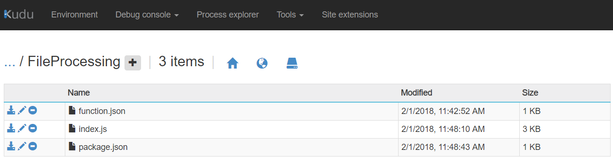</kbd>

6. In the debug console, make sure you are in the FileProcessing folder.

7. Execute the npm install command in the debug console (in the FileProcessing folder) to install the required packages.
    **For example:**
    <kbd>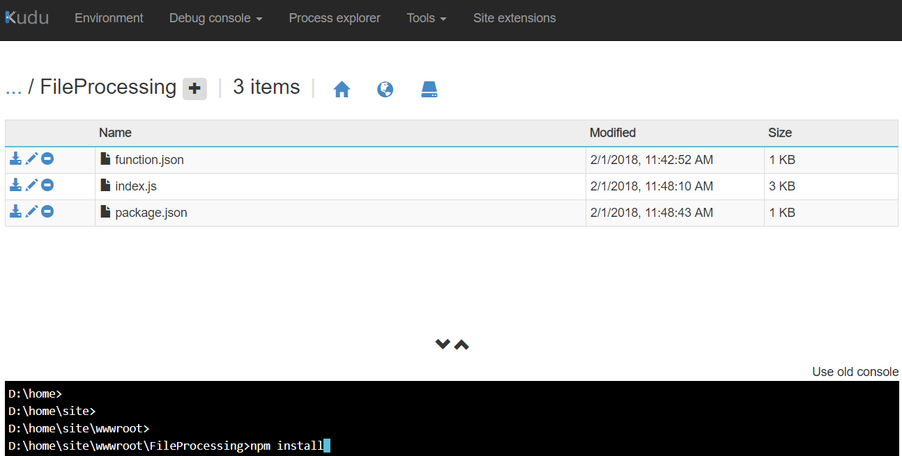</kbd>
    <kbd>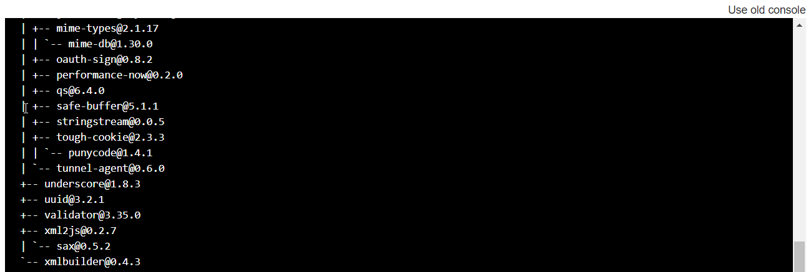</kbd>

</p></details>

### 4 Validate Installation and Configuration

1. Upload the [data.json](assets/taxi-2008-02.json) file to the filecontents container in the Azure Blob service you just created.
   **For example:**
   <kbd>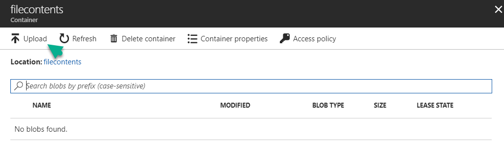</kbd>
   <kbd>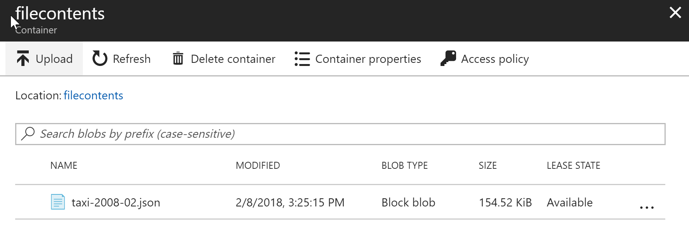</kbd>

2. Finally, go to Cosmos DB Data explorer to view the data from the JSON file in the Cosmos DB.
   **For example:**
   <kbd>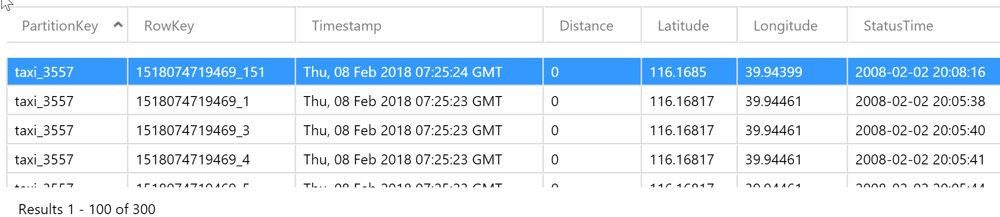</kbd>

[blob-trigger]:https://docs.microsoft.com/en-us/azure/azure-functions/functions-bindings-storage-blob#trigger
[this-article]:https://docs.microsoft.com/en-us/azure/azure-functions/functions-create-storage-blob-triggered-function
[the-article]:https://docs.microsoft.com/en-us/azure/azure-functions/functions-reference-node#node-version-and-package-management