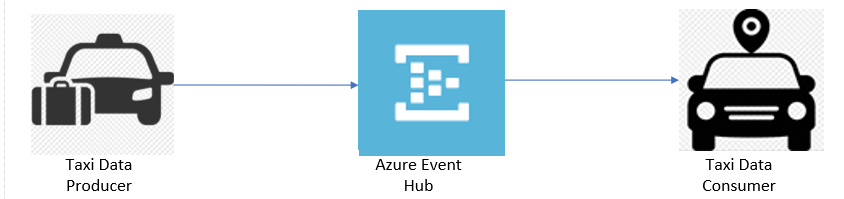
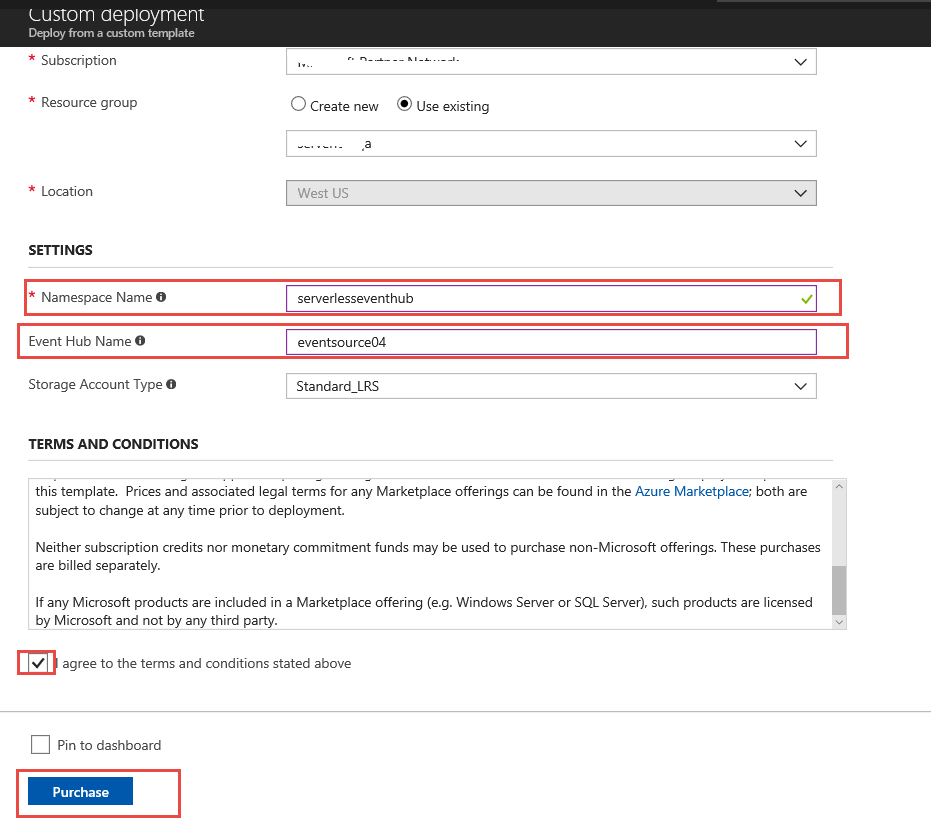
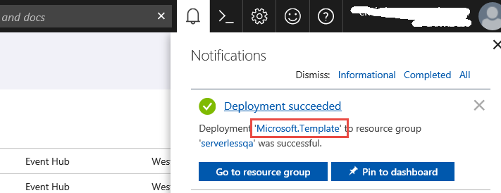
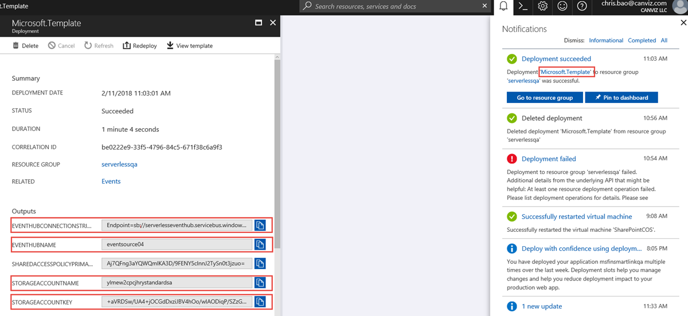

# Module 2: Real-time Data Streaming

In this module you'll create an Azure Event Hub to collect and store sensor data from your taxi data producer. Using the provided command-line clients, you'll emit sensor data from a taxi and read from the stream. In subsequent modules you'll add functionality to analyze and persist this data using Azure Stream Analytics, Azure Functions, and an Azure CosmosDB.

## Architecture Overview

The architecture for this module involves a taxi data producer, an Azure Event Hub, and a taxi data consumer:

<kbd></kbd>

The taxi producer sends location data to simulate a sensor attached to a taxi driving in a city. The taxi producer emits messages from a data file captured from a real taxi. The message includes the taxi's current location and the distance traveled from the previous location record.

The Azure Event Hub stream stores the data sent by the taxi producer and provides an interface to allow consumers to process and analyze the data. The consumer is a simple command-line utility that reads the stream and outputs the data points from the stream in effectively real-time so you can see what data is being stored in the stream.

## Implementation Instructions

### 1. Create an Azure Event Hub

<details>
<summary><strong>Step-by-step instructions (expand for details)</strong></summary><p>

1. Log into the Azure Management Portal with an account that has permissions to deploy new Azure resources.

2. To deploy a customized template through the portal, click **Create a resource**, and search for **Template Deployment** until you can select it from the options.

3. Click **Template Deployment**
4. Click **Create**

5. You see several options for creating a template. Click **Build your own template in the editor**.

6. You now have a blank template that is available for customizing. Delete the JSON in the blank template, then paste in the JSON from the [azuredeploy.json](./azuredeploy.json) file.

7. Click **Save**.

8. Enter a name for the **Resource group**.
9. Enter a new name for the **Namespace** and **Event Hub**
   **For example**: 
    <kbd></kbd>

10. Check the **I agree to the terms and conditions stated above** checkbox.

11. Click **Purchase**.

12. Please DO NOT close the browser window running the Azure resource deployment.  
13. After the Azure resources are deployed successfully, click the **Microsoft.Template** link to see the output values for **EVENTHUBCONNECTIONSTRING**, **EVENTHUBNAME**, 
**STORAGEACCOUNTNAME**, **STORAGEACCOUNTKEY**.  
14. **Copy and paste** these values into a text file.
15. **Save** the text file.

    You will use the values in subsequent steps.

    <kbd>
    </kbd>

</p></details>

### 2. Use the producer to add messages to the stream

>**Note:** If you wish to run the producer from Visual Studio, please see the instructions in the [ConsoleAppsReadme.md](../clients/ConsoleAppsReadme.md).

Use the command-line producer for macOS, Linux, or Windows to add messages to the stream.

1. First, download the producer for macOS([producer-osx-x64.zip](../clients/binary/producer-osx-x64.zip)), Linux([producer-linux-x64.zip](../clients/binary/producer-linux-x64.zip)) and Windows([producer-win10-x64.zip](../clients/binary/producer-win10-x64.zip))

2. Unzip the file.
3. Open the appsettings.json file.
4. Update the **connectionString** & **eventHubName** values with the **EVENTHUBCONNECTIONSTRING**, **EVENTHUBNAME** values you saved in the text file.


   ```javascript
   {
     "eventHubs": {
       "connectionString": "<EVENTHUBCONNECTIONSTRING>",
       "eventHubName": "<EVENTHUBNAME>"
     },
     "clientFiles": "3015.txt"
   }
   ```

5. **Save** the file

>**Note:** If you wish to run the consumer from Visual Studio, please see the instructions in the [ConsoleAppsReadme.md](../clients/ConsoleAppsReadme.md).

6. Next, download the consumer for macOS([consumer-osx-x64.zip](../clients/binary/consumer-osx-x64.zip)), Linux([consumer-linux-x64.zip](../clients/binary/consumer-linux-x64.zip)) and Windows([consumer-win10-x64.zip](../clients/binary/consumer-win10-x64.zip))

6. Unzip the file
7. Open the appsettings.json file
8. Update the **connectionString**,**eventHubName**, **accountName**, and **accountKey** values with the **EVENTHUBCONNECTIONSTRING**, **EVENTHUBNAME**, **STORAGEACCOUNTNAME**, and **STORAGEACCOUNTKEY** values you saved in the text file.
9. Change the **containerName** value to and **serverless02**.


   ```javascript
   {
     "eventHubs": {
       "connectionString": "<EVENTHUBCONNECTIONSTRING>",
       "eventHubName": "<EVENTHUBNAME>"
     },
     "storageAccount": {
     "accountName": "<STORAGEACCOUNTNAME>",
     "accountKey": "<STORAGEACCOUNTKEY>",
     "containerName": "serverless02"
     }
   }

   ```


10. **Save** the file.
11. Go to the folder that hosts the extracted taxi producer files and run the taxi data producer to start emitting sensor data to the Azure Event Hub.

   In Mac & Linux environments, run the following command: 
   ```console
   ./producer
   ```

   In a Windows environment, run the following command in the CMD console: 
   ```console
   producer.exe
   ```

   Each time the producer sends a message to the stream it prints a period on the screen, like this:
   ```console
   ./producer or producer.exe
   ...................................................................
   ...................
   ```

### 3. Validation

1. Open another command prompt and go to the folder that hosts the extracted taxi consumer files.
2. Run the consumer to start reading sensor data from the Azure Event Hub. 

   In Mac & Linux environments, run the following command:  
   ```console
    ./consumer
   ```

   In a Windows environment, run the following command in the CMD console: 
   ```console
    consumer.exe
   ```

    The consumer prints the messages sent by the producer:
    ```console
    Message received. Partition: '0', Data: '{"Name":"3015","DateTime":"2008-02-02T13:33:03","Latitude":116.40584,"Longtitude":39.89724,"Distance":3.0}'
    Message received. Partition: '0', Data: '{"Name":"3015","DateTime":"2008-02-02T13:33:05","Latitude":116.40584,"Longtitude":39.8973,"Distance":1.0}'
    ```

2. Experiment with the producer:

   1. Stop the producer by pressing any key and notice the messages stop.
 
   2. Start the producer again and notice the messages resume.

   3. Start another instance of the producer in another tab or console. Use the command line arguments to provide another client trace file as a data source and notice the data from both client producers is shown in the consumer's output:
     In Mac & Linux environments, run the following command: 
     ```console
     ./producer --clientFiles=3557.txt
      ```
     In a Windows environment, run the following command in the CMD console: 
     ```console
     producer.exe --clientFiles=3557.txt
     ```
     
     ```console
     Message received. Partition: '0', Data:  '{"Name":"3557","DateTime":"2008-02-02T20:07:06","Latitude":116.16814,"Longtitude":39.94459,"Distance":0.0}'
     Message received. Partition: '0', Data: '{"Name":"3015","DateTime":"2008-02-02T13:47:44","Latitude":116.43233,"Longtitude":39.902,"Distance":8.9}'
     Message received. Partition: '0', Data: '{"Name":"3557","DateTime":"2008-02-02T20:07:07","Latitude":116.16814,"Longtitude":39.94459,"Distance":0.0}'
     Message received. Partition: '0', Data: '{"Name":"3015","DateTime":"2008-02-02T13:47:46","Latitude":116.43213,"Longtitude":39.902,"Distance":12.2}'
     ```

After you've finished experimenting with the producer you can stop the producers and consumer and move on to the next module: [Streaming Aggregation][streaming-aggregation-module].

