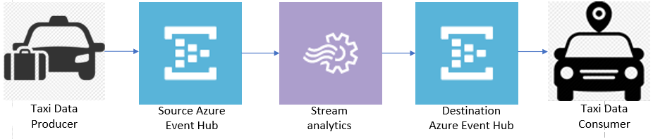
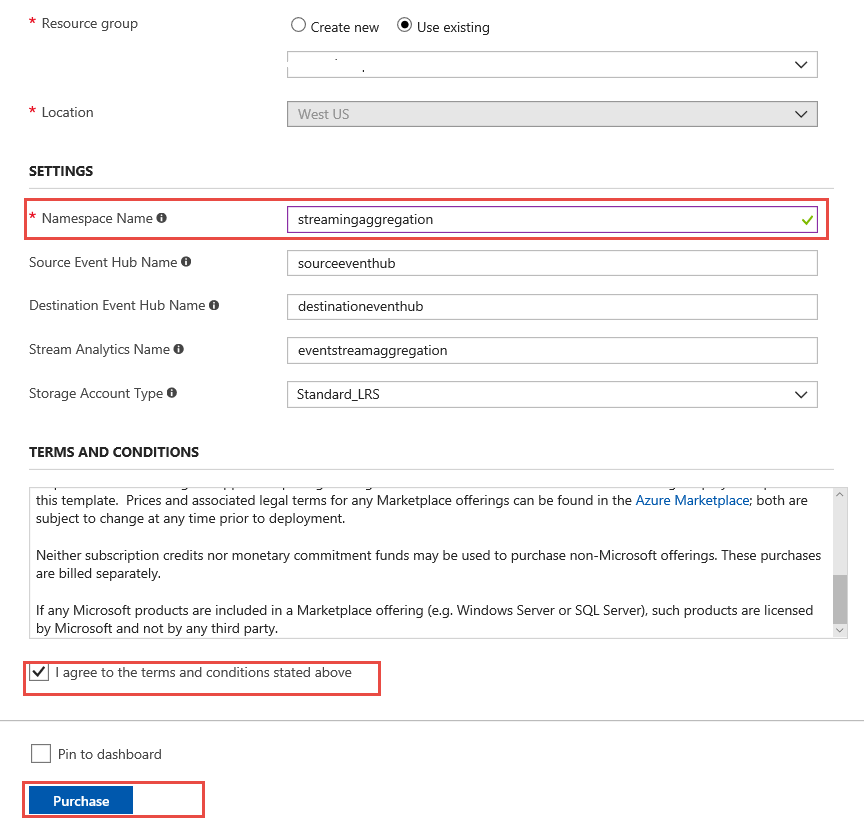
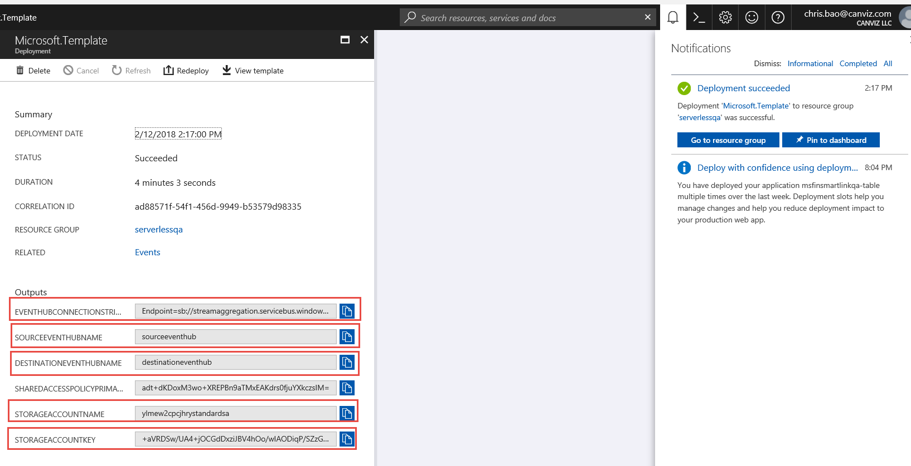

# Module 3: Streaming Aggregation

In this module you'll create an Azure Stream Analytics application to aggregate sensor data from the taxi in real-time. The application will read from the stream, calculate the total distance a taxi has currently traveled and output the aggregated statistics to an Azure EventHub every minute.

## Architecture Overview

The architecture for this module includes Azure Stream Analytics, source and destination Azure Event Hubs, and the producer and consumer command-line clients:

<kbd></kbd>

The taxi producer that simulates a sensor attached to a taxi driving in a city is the same as the previous module. The taxi producer emits messages from a data file captured from a real taxi. The message includes the taxi's current location and the distance traveled from the previous location record.

Azure Stream Analytics processes data from the source Azure Event Hub and aggregates it on a per-minute basis. Each minute, Azure Stream Analytics emits data including the total distance traveled in the last minute. This data is sent to a destination Azure Event Hub for processing by other components in the system.

## Implementation Instructions

### 1. Create Azure Event Hubs and Azure Stream Analytics

<details>
<summary><strong>Step-by-step instructions (expand for details)</strong></summary><p>

1. Log into the Azure Management Portal with an account that has permissions to deploy new Azure resources.

2. To deploy a customized template through the portal, click **Create a resource**, and search for **Template Deployment** until you can select it from the options.

3. Click **Template Deployment**
4. Click **Create**

5. You see several options for creating a template. Click **Build your own template in the editor**.

6. You now have a blank template that is available for customizing. Delete the JSON in the blank template, then paste in the JSON from the [azuredeploy.json](./azuredeploy.json) file.

7. Click **Save**.

8. Enter a name for the **Resource group**.
9. Enter a new name for the **Namespace** and **Event Hub**
   **For example**: 
   <kbd></kbd>

10. Check the **I agree to the terms and conditions stated above** checkbox

11. Click **Purchase**

12. Please DO NOT close the browser window running the Azure resource deployment.  
13. After the Azure resources are deployed successfully, click the **Microsoft.Template** link to see the output values for **EVENTHUBCONNECTIONSTRING**, **SOURCEEVENTHUBNAME**, **DESTINATIONEVENTHUBNAME**, 
**STORAGEACCOUNTNAME**, **STORAGEACCOUNTKEY**.  
14. **Copy and paste** these values into a text file
15. **Save** the text file

    You will use the values in subsequent steps.

    <kbd>
    </kbd>

</p></details>


### 2. Use the producer to add messages to the stream

>**Note:** If you wish to run the producer from Visual Studio, please see the instructions in the [ConsoleAppsReadme.md](../clients/ConsoleAppsReadme.md).

Use the command-line producer for macOS, Linux, or Windows to add messages to the stream.

1. First, download the producer for macOS([producer-osx-x64.zip](../clients/binary/producer-osx-x64.zip)), Linux([producer-linux-x64.zip](../clients/binary/producer-linux-x64.zip)) and Windows([producer-win10-x64.zip](../clients/binary/producer-win10-x64.zip))

> The producer and consumer applications are same ones from the previous module. You need not to download them again. **But the parameters in appsettings.json are different and must be modified. You cannot skip following steps.**

2. Unzip the file
3. Open the appsettings.json file
4. Update the **connectionString** & **eventHubName** values with the **EVENTHUBCONNECTIONSTRING**, **SOURCEEVENTHUBNAME** values you saved in the text file.

   ```javascript
   {
     "eventHubs": {
       "connectionString": "EVENTHUBCONNECTIONSTRING",
       "eventHubName": "SOURCE EVENTHUBNAME"
     },
     "clientFiles": "3015.txt"
   }
   ```

>**Note:** If you wish to run the consumer from Visual Studio, please see the instructions in the [ConsoleAppsReadme.md](../clients/ConsoleAppsReadme.md).

5. **Save** the file
6. Next, download the consumer for macOS([consumer-osx-x64.zip](../clients/binary/consumer-osx-x64.zip)), Linux([consumer-linux-x64.zip](../clients/binary/consumer-linux-x64.zip)) and Windows([consumer-win10-x64.zip](../clients/binary/consumer-win10-x64.zip))

7. Unzip the file
8. Open the appsettings.json file
9. Update the **connectionString**,**eventHubName**, **accountName**, **accountKey** and **containerName** values with **EVENTHUBCONNECTIONSTRING**, **DESTINATIONEVENTHUBNAME**, **STORAGEACCOUNTNAME**, **STORAGEACCOUNTKEY** and **serverless03** values you saved in the text file. 
10. Change the **containerName** value to and **serverless03**.

   ```javascript
   {
     "eventHubs": {
       "connectionString": "<EVENTHUBCONNECTIONSTRING>",
       "eventHubName": "<DESTINATIONEVENTHUBNAME>"
     },
     "storageAccount": {
     "accountName": "<STORAGEACCOUNTNAME>",
     "accountKey": "<STORAGEACCOUNTKEY>",
     "containerName": "serverless03"
     }
   }

   ```

11. **Save** the file
12. Go to the folder that hosts the extracted taxi producer files and run the taxi data producer to start emitting sensor data to the Azure Event Hub.

   In Mac & Linux environments, run the following command:
   ```console
   ./producer
   ```

   In a Windows environment, run the following command in the CMD console: 

   ```console
   producer.exe
   ```

   Each time the producer sends a message to the stream it prints a period on the screen, like this:
   ```console
   ./producer or producer.exe
   ...................................................................
   ...................
   ```
## 3. Validation

1. Go to the folder that hosts the extracted taxi consumer files and run the consumer to start reading sensor data from Azure event hub. 

   In Mac & Linux environments, run the following command: 
   ```console
    ./consumer
   ```

   In a Windows environment, run the following command in the CMD console: 
   ```console
    consumer.exe
   ```

   The consumer prints the messages sent by the producer.  Keep in mind this messages are only sent every minute, so you will not see them appear instantly.
   ```console
    Message received. Partition: '0', Data: '{"name":"3015","datetime":"2018-02-11T20:51","countnum":26,"sum":387.40000000000003}'
    Message received. Partition: '0', Data: '{"name":"3015","datetime":"2018-02-11T20:53","countnum":16,"sum":37.199999999999996}'
   ```