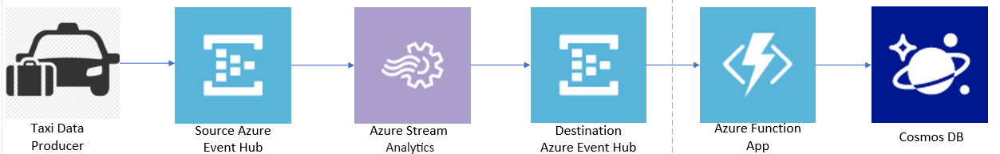
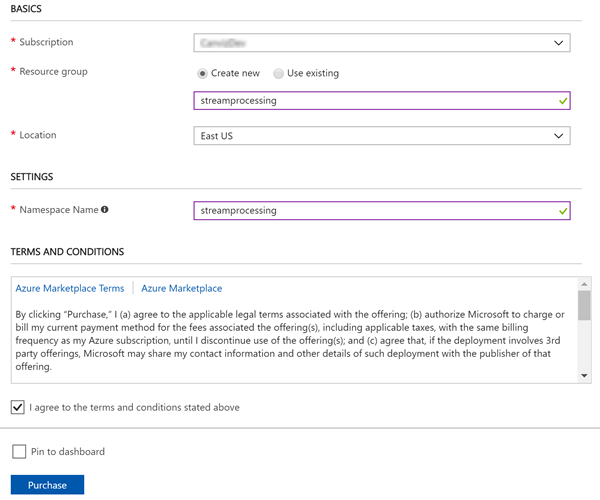
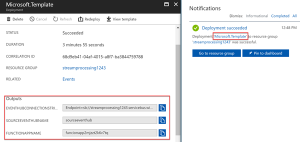
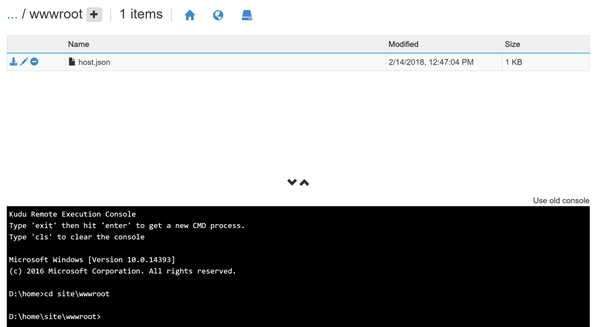
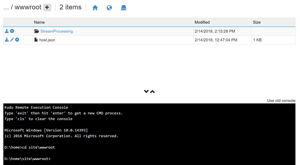
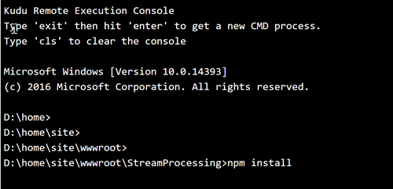

# Module 4: Stream Processing

In this module you'll use an Azure Function App to process data from an Azure Event Hub. The Function App will read data from the stream and write the aggregated taxi sensor data to an Azure Cosmos DB table.

## Architecture Overview

<kbd></kbd>

The producer simulates a sensor attached to a taxi track data. The producer emits data every second, including the taxi's current location and distance traveled in the last second.

The Azure Stream Analytics job aggregates the per-second data and emits a single record each minute with a sum of distance traveled for each taxi.

These aggregated messages are then sent to another Azure Event Hub.

In this module you'll create an Azure Function App to process the aggregated stream and write those records to an Azure Cosmos DB table.

## Implementation Instructions

### Create Azure resources

<details>
<summary><strong>Step-by-step instructions (expand for details)</strong></summary><p>

1. Log into the Azure Management Portal with an account that has permissions to deploy new Azure resources.

2. To deploy a customized template through the portal, click **Create a resource**, and search for **Template Deployment** until you can select it from the options.

3. Click **Template Deployment**
4. Click **Create**
5. You see several options for creating a template. Click **Build your own template in the editor**.

6. You now have a blank template that is available for customizing. Delete the JSON in the blank template, then paste in the JSON from the [azuredeploy.json](./azuredeploy.json) file.

7. Click **Save**.
8. Enter a name for the **Resource group**.
9. Enter a new name for the **Namespace**
   **For example**: 
    <kbd></kbd>

10. Check the **I agree to the terms and conditions stated above** checkbox.

11. Click **Purchase**.

12. Please DO NOT close the browser window running the Azure resource deployment.  
13. After the Azure resources are deployed successfully, click the **Microsoft.Template** link to see the output values for **EVENTHUBCONNECTIONSTRING**, **SOURCEEVENTHUBNAME**, and **FUNCTIONAPPNAME**.  
14. **Copy and paste** these values into a text file.
15. **Save** the text file.

    You will use the values in subsequent steps.

	<kbd></kbd>

</p></details>

### Azure Function Configuration

<details>
<summary><strong>Step-by-step instructions (expand for details)</strong></summary><p>

1. In a web browser, go to https://<function_app_name>.scm.azurewebsites.net/DebugConsole

   >**Note:** Replace the <function_app_name> placeholder with the **FUNCTIONAPPNAME** value you saved in the text file.

2. Click **site**, then click **wwwroot** to go to the D:\home\site\wwwroot directory.
3. Upload the [StreamProcessing](assets/) folder by dragging and dropping it from your local file system to the wwwroot folder at the top half of the page.
 
   >**Note:** You may have to manually create the [StreamProcessing](assets/) folder in some browsers and then drag & drop the files into the new folder.

   <kbd></kbd>

   After you upload it, you will see it appear in the file list:

   <kbd></kbd>

3. Type **CD StreamProcessing** in **Debug console**, and then press the **Enter** key.

4. Type **NPM install** in **Debug console**, and then press the **Enter** key.

   <kbd></kbd>

   <kbd></kbd>

</p></details>


##  Validation

>**Note:** If you wish to run the producer from Visual Studio, please see the instructions in the [ConsoleAppsReadme.md](../clients/ConsoleAppsReadme.md).

Use the command-line producer for macOS, Linux, or Windows to produce messages into the stream.

1. First, download the producer for macOS([producer-osx-x64.zip](../clients/binary/producer-osx-x64.zip)), Linux([producer-linux-x64.zip](../clients/binary/producer-linux-x64.zip)) and Windows([producer-win10-x64.zip](../clients/binary/producer-win10-x64.zip))

> The producer and consumer applications are same ones from the previous module. You need not to download them again. **But the parameters in appsettings.json are different and must be modified. You cannot skip following steps.**

2. Unzip the file
3. Open the appsettings.json file
4. Unzip the producer and update **connectionString** & **eventHubName** values  with the **EVENTHUBCONNECTIONSTRING**, **SOURCEEVENTHUBNAME** values you saved in the text file.

   ```javascript
   {
     "eventHubs": {
       "connectionString": "EVENTHUBCONNECTIONSTRING",
       "eventHubName": "SOURCEEVENTHUBNAME"
     },
     "clientFiles": "3015.txt"
   }
   ```
5. **Save** the file.
6. Go to the folder that hosts the extracted taxi producer files and run the taxi data producer to start emitting sensor data to the Azure event hub.

   In Mac & Linux environments, run the following command: 
    ```console
    ./producer
    ```

   In a Windows environment, run the following command in the CMD console: 
    ```console
    producer.exe
    ```

    Each time the producer sends a message to the stream it prints a period on the screen, like this:
   ```console
   ./producer or producer.exe
   ...................................................................
   ...................
   ```

7. Finally, go to newly created Cosmos DB and click **Data Explorer** to view the data from the JSON file in the Cosmos DB.
   **For example:**
   <kbd></kbd>
