#  Module 5: Data Archiving

In this module you'll create an Azure Data Lake Store to capture data from the Event Hubs created in Data Streaming Module. You will then use Data Lake Analytics to run analysis jobs against the raw data.

## Architecture Overview
<kbd>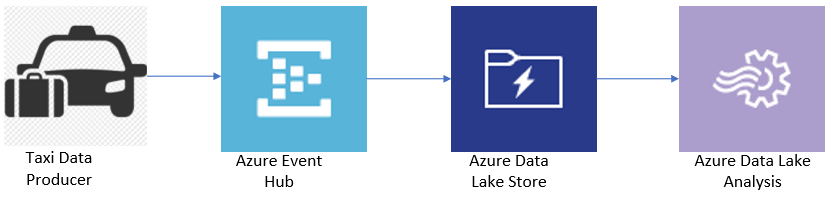</kbd>

The architecture for this module builds on the Azure Event Hub created in the Data Streaming Module.  The Azure Lake Data Store will capture the streaming data. Then Azure Data Analytics will run a query job against the data in the Azure Data Lake Store.

The producer simulates a sensor attached to a taxi track data. The producer emits data every second, including the taxi's current location and distance traveled in the last second.

## Implementation Instructions

### Create Azure Resources

<details>
<summary><strong>Step-by-step instructions (expand for details)</strong></summary><p>

1. Log into the Azure Management Portal with an account that has permissions to deploy new Azure resources.

2. To deploy a customized template through the portal, click **Create a resource**, and search for **Template Deployment** until you can select it from the options.

3. Click **Template Deployment**

4. Click **Create**

5. You see several options for creating a template. Click **Build your own template in the editor**.

6. You now have a blank template that is available for customizing. Delete the JSON in the blank template, then paste in the JSON from the [azuredeploy.json](azuredeploy.json) file.

7. Click **Save**.

8. Enter a new name for the **Resource group**, and refer to the screenshot below  to fill in the **remaining parameters**.  You can enter any names you like for these parameters.
   <kbd>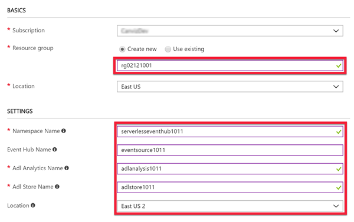</kbd>
9. Check the **I agree to the terms and conditions stated above** checkbox.

10. Click **Purchase**.

11. Please DO NOT close the browser window running the Azure resource deployment.  
12. After the Azure resources are deployed successfully, click the **Microsoft.Template** link to see the output values for **EVENTHUBCONNECTIONSTRING** and **EVENTHUBNAME**.  
13. **Copy and paste** these values into a text file.
14. **Save** the text file.

    You will use the values in subsequent steps.

    <kbd></kbd>
    <br/><br/>
    <kbd>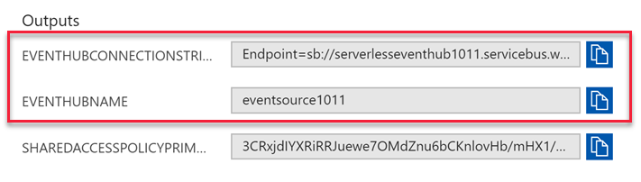</kbd>

</p></details>

### Assign permissions to access the Event Hubs

<details>
<summary><strong>Step-by-step instructions (expand for details)</strong></summary><p>

1. Open the Azure Data Lake Store created by the template deployment in the Create Azure Resources section and click **Data Explorer**.
   <kbd>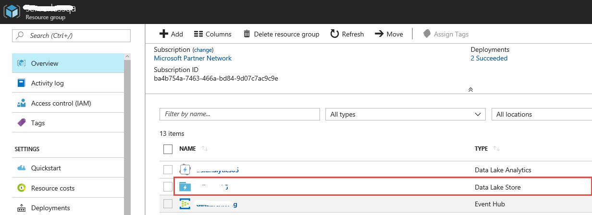</kbd>
   <kbd></kbd>

2. Click **New Folder**.
3. Enter a **folder name** for the folder where you want to capture the data from Event Hubs
4. Click **OK**
   <kbd></kbd>

5. Assign permissions to the root of the Azure Data Lake Store.
   - Click **Data Explorer**
   - Select the root of the Azure Data Lake Store
   - Click **Access**
      <kbd></kbd>
        
   - Under **Access**, click **Add**
   - Click **Select User or Group**
   - Enter **Microsoft.EventHubs** in the search box 
   - Click **Microsoft.EventHubs**
   - Click **Select**
   
      <kbd></kbd>

   - Click **Select**
   - Under **Assign Permissions**, click **Select Permissions**
   - Set **Permissions** to **Execute**
   - Set **Add to** to **This folder and all children**
   - Set **Add as** to **An access permission entry and a default permission entry** 

      <kbd></kbd>

   - Click **OK**.

   - Assign permissions to the newly created folder in the Azure Data Lake Store. (In this example it is named **archivefolder**.)
      * Click **Data Explorer**
      * Select the new created **archivefolder** in the Azure Data Lake Store
      * Click **Access**
      
         <kbd></kbd>

      * Under **Access**, click **Add**
      * **Select User or Group**
      * Enter **Microsoft.EventHubs** in the search box 
      * Click **Microsoft.EventHubs**
      
         <kbd></kbd>

      * Click **Select**
      * Under Assign Permissions, click **Select Permissions**
        Set **Permissions** to **Read, Write, and Execute**
        Set **Add to** to **This folder and all children**
        Set **Add as** to **An access permission entry and a default permission entry**

         <kbd></kbd>

      * Click OK.

      * Close the **Access window**
      * Refer to steps 2-4 to create a new folder named **Assemblies**
      * Upload all files from the [Assembly folder](Assets/Assemblies) to the Assemblies folder you just created.
      
      >**Note:** You will use these assembly files to configure **Data Lake Analysis** for parsing the **AVRO** formatted file in subsequent steps.

</p></details>


### Configure the Event Hubs to capture data to the Data Lake Store

<details>
<summary><strong>Step-by-step instructions (expand for details)</strong></summary><p>

1. Open the **Event Hub** created by the template deployment in the Create Azure Resources section
2. In **ENTITIES** section in the left side menu click **Event Hubs** 
3. Click the Event Hub in the list
   <kbd>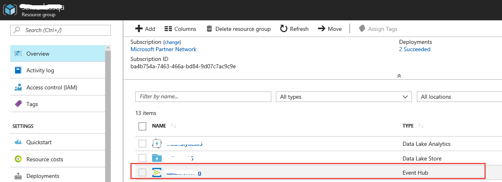</kbd>

   <kbd>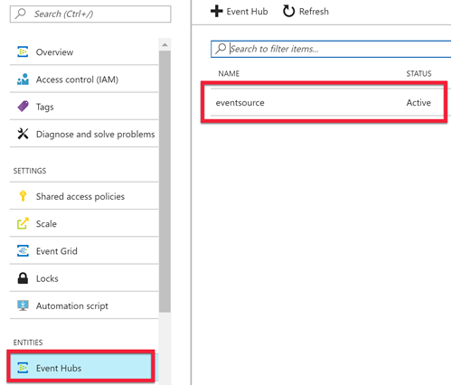</kbd>

2. In the **FEATURES** section in the left side menu click **Capture**
   
   - Set **Capture** to **On**

   - For the **Capture Provider**, select **Azure Data Lake Store** 
   - Click **Select Store**
   - Select the Azure Data Lake Store created by the template deployment in the Create Azure Resources section that started this lab
      For **Data Lake Path**, enter the new folder you created (**archivefolder** in this example) in the Data Lake Store account. 
      You only need to provide the relative path to the folder.

   - Leave the **Sample capture file name formats** as the default value. This option governs the folder structure that is created under the capture folder.

   - Click **Save Changes**
   
   		<kbd></kbd>

</p></details>


### Configure Data Lake Analytics

<details>
<summary><strong>Step-by-step instructions (expand for details)</strong></summary><p>

1. Open the **Data Lake Analytics** the template created in this lab

2. Click **New Job**, and copy the text from the [1_RegisterAssemblies.usql](Assets/USQL/1_RegisterAssemblies.usql) file and paste it in the textbox

   <kbd>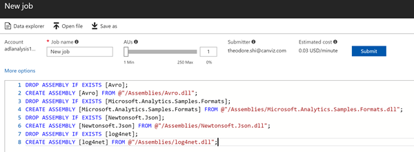</kbd>

3. Click file and paste it in the textbox
4. Wait for the script to finish executing.  It should take about one minute.

   <kbd>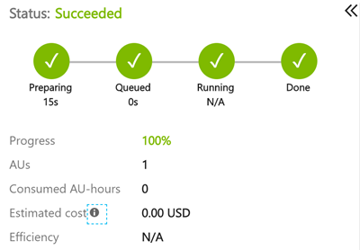</kbd>

</p></details>


### Use the producer to add messages to the stream

<details>
<summary><strong>Step-by-step instructions (expand for details)</strong></summary><p>

>**Note:** If you wish to run the producer from Visual Studio, please see the instructions in the [ConsoleAppsReadme.md](../clients/ConsoleAppsReadme.md).

1. First, download the producer for macOS([producer-osx-x64.zip](../clients/binary/producer-osx-x64.zip)), Linux([producer-linux-x64.zip](../clients/binary/producer-linux-x64.zip)) and Windows([producer-win10-x64.zip](../clients/binary/producer-win10-x64.zip))

2. Unzip the file
3. Open the appsettings.json file
4. Update the **connectionString** & **eventHubName** values with the **EVENTHUBCONNECTIONSTRING**, **EVENTHUBNAME** values you saved in the text file.

   ```javascript
   {
     "eventHubs": {
       "connectionString": "EVENTHUBCONNECTIONSTRING",
       "eventHubName": "EVENTHUBNAME"
     },
     "clientFiles": "3015.txt"
   }
   ```

5. **Save** the file
6. Go to the folder that hosts the extracted taxi producer files and run the taxi data producer to start emitting sensor data to the Azure Event Hub.

   In Mac & Linux environments, run the following command: 
   ```console
   ./producer
   ```

   In a Windows environment, run the following command in the CMD console: 
   ```console
   producer.exe
   ```

   Each time the producer sends a message to the stream it prints a period on the screen, like this:
   ```console
   ./producer or producer.exe
   ...................................................................
   ...................
   ```

</p></details>


### Implementation Validation

<details>
<summary><strong>Step-by-step instructions (expand for details)</strong></summary><p>

1. Open **Data Lake Analytics**
2. Click **Data explorer**
3. Select the first folder you created (**archivefolder** in this example) and navigate into it 2 folders deep
4. In a text file, create a string that represents this path and save to a temp text file
 
>**Note:** The folder path format follows this format ```\archivefolder\Event Hub Namespace Name\Event Hub Name```
 
  <kbd>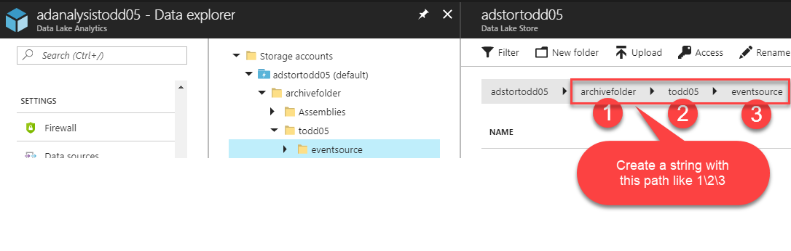</kbd>

5. Click **New Job**, and then copy the text from the [2_SimpleAvro.usql](Assets/USQL/2_SimpleAvro.usql) file and paste it into the textbox
      
6. Replace the **highlighted path** in the screenshot below with the path saved in the temp file, then click **Submit**

   <kbd>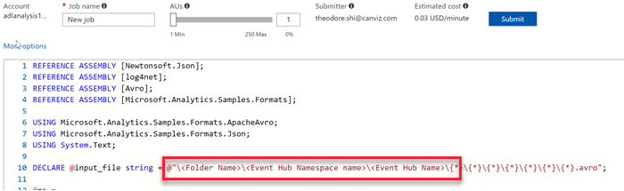</kbd>

7. Wait for the script to finish executing.  It should take about one minute.

   <kbd></kbd>

8. Close the **job window**

9. Click **Data explorer** 
10. Click the **Result.csv** in the root folder
   
	<kbd>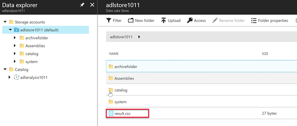</kbd>

10. View the taxi data in the Result.csv file.

</p></details>