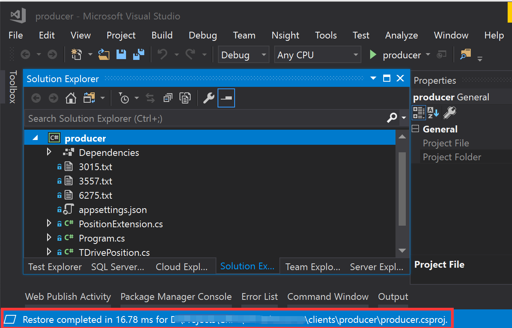
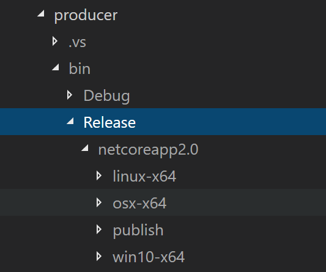
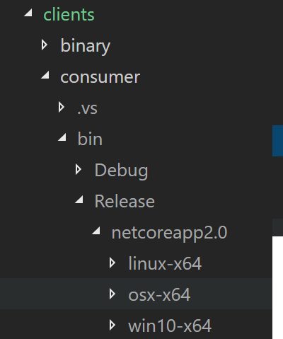

# Producer and Consumer Console Apps

The producer is a console app. It simulates a sensor attached to a taxi driving in a city. It loads data from files that record the locations of taxi and emits to Azure Event Hub. The consumer is also a console app. It reads messages from Azure Event Hub and prints the messages to console. 

The producer and the consumer are implemented in C#. They are running on the cross-platform .NET Core 2.0.

## 1. Run & Debug with Visual Studio 2017
### 1.1. Prerequisites
   1. You need Visual Studio 2017 version 15.3.0 or higher with the **.NET Core cross-platform development** workload. Please follow this [official guide](https://docs.microsoft.com/en-us/dotnet/core/windows-prerequisites?tabs=netcore2x) to install this workload. 
   2. An existing Azure Event Hub. Follow this link to [create an Event Hub](https://docs.microsoft.com/en-us/azure/event-hubs/event-hubs-create) in the Azure Portal.
   3. An existing Storage Account. Follow this link to [create a Storage Account](https://docs.microsoft.com/en-us/azure/storage/common/storage-quickstart-create-account?tabs=portal) in the Azure Portal.

### 1.2. Debugging the producer
   1. Launch Visual Studio 2017 and open project file ```producer.csproj``` in the ```client/producer``` folder.
   2. Check ```appsettings.json``` file to make sure the properties **connectionString** and **eventHubName** are configured correctly. 
   3. You can press **F5** to start the app in debug mode. Visual Studio 2017 will then start restoring the dependency packages, after which the debugger will start.
> **Note:** Make sure your project path does not contain any special characters (such as %20) otherwise restoring of NuGet packages may fail with an error message similar to this: ```The operation failed as details for project producer could not be loaded.```

   <kbd></kbd>

   4. Press **Shift + F5** to exit debug mode.

### 1.3. Debugging the consumer
   1. Launch Visual Studio 2017 and open project file ```consumer.csproj``` in the ```client/consumer``` folder.
   2. Check ```appsettings.json``` file to make sure the properties **connectionString**, **eventHubName**, **accountName** and **accountKey** are configured correctly. 
   3. You can press **F5** to start the app in debug mode. Visual Studio 2017 will then start restoring the dependency packages, after which the debugger will start.
> **Note:** Make sure your project path does not contain any special characters (such as %20) otherwise restoring of NuGet packages may fail with an error message similar to this: ```The operation failed as details for project producer could not be loaded.```

   <kbd></kbd>
   4. Press **Shift + F5** to exit debug mode.

## 2. Build
### 2.1. Prerequisites
  1. Install .NET Core on your environment ([Windows](https://docs.microsoft.com/en-us/dotnet/core/get-started#windows), [Linux](https://docs.microsoft.com/en-us/dotnet/core/get-started#linux) or [macOS/OS X](https://docs.microsoft.com/en-us/dotnet/core/get-started#os-x--macos))

### 2.2. Producer
  1. Switch to producer folder
  ```console
  cd clients\producer
  ```

  2. Restore
  ```console
  dotnet restore
  ```

  3. Build
  ```console
  dotnet build
  ```

  4. Publish
  
  For Windows 10
  ```console
  dotnet publish -c Release -r win10-x64
  ```
  For Linux
  ```console
  dotnet publish -c Release -r linux-x64
  ```
  For macOS
  ```console
  dotnet publish -c Release -r osx-x64
  ```

  The default output location is client\producer\bin\Release\netcoreapp2.0
  <kbd></kbd>

### 2.3. Consumer
  1. Switch to consumer folder
  ```console
  cd clients\consumer
  ```

  2. Restore
  ```console
  dotnet restore
  ```

  3. Build
  ```console
  dotnet build
  ```

  4. Publish

  For Windows 10
  ```console
  dotnet publish -c Release -r win10-x64
  ```
  For Linux
  ```console
  dotnet publish -c Release -r linux-x64
  ```
  For macOS
  ```console
  dotnet publish -c Release -r osx-x64
  ```

  The default output location is client\consumer\bin\Release\netcoreapp2.0
  <kbd></kbd>

### 3. Conclusion

Now, you have an executable in your output folder that will allow you to run the producer and consumer without the use of Visual Studio.

